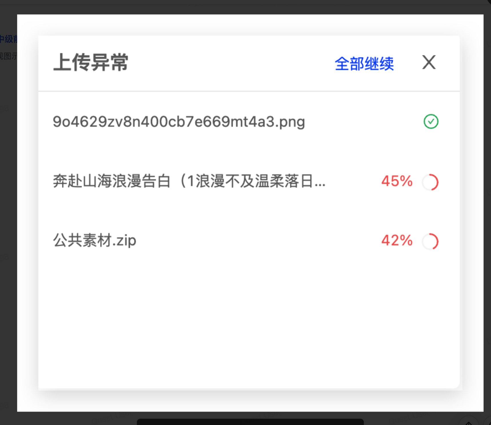
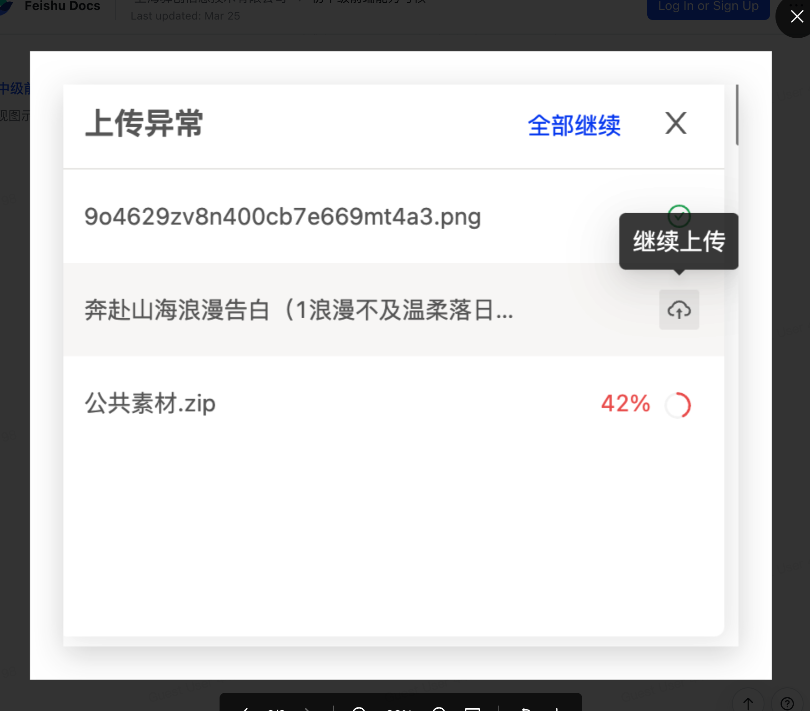

基本要求

1. 前端框架: 请基于 React(>=18.0)、Vue3 或 Angular(>=17.0)、Solid.JS 中任选一个。
2. CSS: 请使用 CSS-in-JS 方案或原子 CSS 方案。

加分项

1. 熟练灵活使用 ts。
2. 脱离脚手架搭建项目，并有一定的规范。
3. 能熟练使用 zustand、jotai、immer、mobx 等库。
4. 能熟练使用 css-in-js 库，能结合原子 CSS 更佳。
5. 灵活使用设计模式。

实现图示的上传列表
要求

1. 上传进度实时展示。
2. 存在失败的上传任务时，点击全部继续支持重试全部失败的任务，失败的任务支持单独重试。
3. 并发限制，同时最多只允许 5 个任务。

